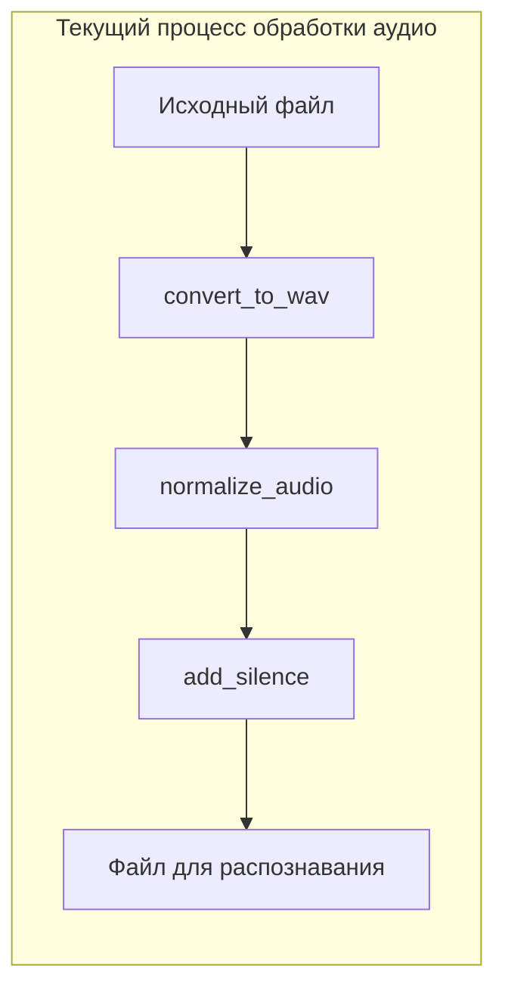
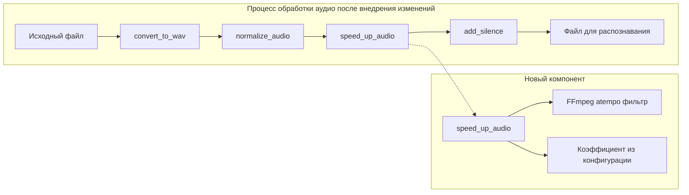
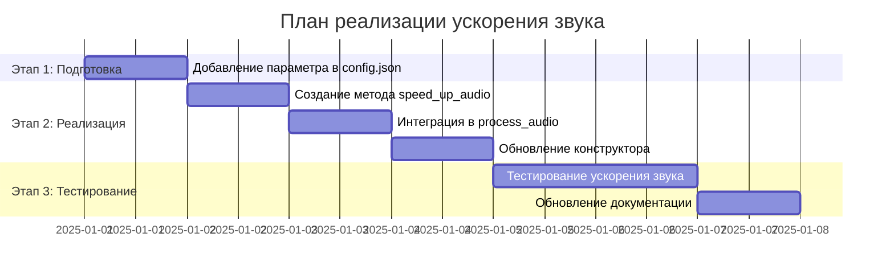
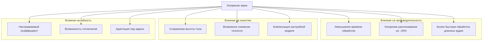
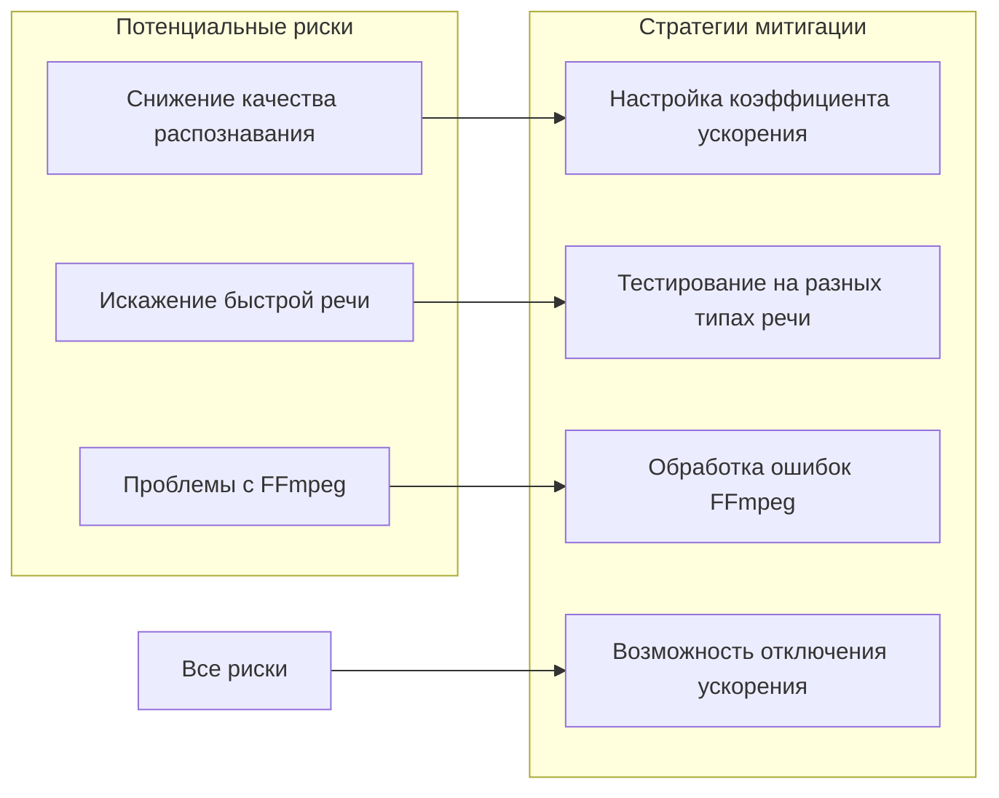

# План реализации ускорения звука на 25% для повышения скорости распознавания

## Краткое резюме

Этот документ описывает план реализации функционала ускорения звука на 25% с использованием FFmpeg для ускорения процесса распознавания речи. Ускорение будет применяться после нормализации аудио, но перед добавлением тишины. Коэффициент ускорения будет вынесен в конфигурационный файл для гибкой настройки.

## Обзор текущего процесса обработки аудио



## Целевой процесс обработки аудио после внедрения изменений



## Технические детали реализации

### 1. Параметр конфигурации

В файл [`config.json`](config.json) будет добавлен новый параметр:

```json
{
    "service_port": 5042,
    "model_path": "/home/text-generation/models/whisper/podlodka-turbo",
    "language": "ru",
    "enable_history": true,
    "chunk_length_s": 28,
    "batch_size": 6,
    "max_new_tokens": 384,
    "temperature": 0.01,
    "return_timestamps": false,
    "audio_rate": 8000,
    "norm_level": "-0.55",
    "compand_params": "0.3,1 -90,-90,-70,-50,-40,-15,0,0 -7 0 0.15",
    "audio_speed_factor": 1.25,
    "file_validation": {
        "max_file_size_mb": 500,
        "allowed_extensions": [".wav", ".mp3", ".ogg", ".flac", ".m4a", ".oga"],
        "allowed_mime_types": ["audio/wav", "audio/mpeg", "audio/ogg", "audio/flac", "audio/mp4", "audio/x-m4a"]
    },
    "allowed_directories": [],
    "version": "1.0.0",
    "log_level": "INFO",
    "log_file": "logs/whisper_api.log"
}
```

### 2. Метод ускорения звука в AudioProcessor

В класс [`AudioProcessor`](app/audio_processor.py) будет добавлен новый метод `speed_up_audio`:

```python
def speed_up_audio(self, input_path: str) -> str:
    """
    Ускоряет воспроизведение аудиофайла с использованием FFmpeg.
    
    Args:
        input_path: Путь к WAV-файлу.
        
    Returns:
        Путь к ускоренному WAV-файлу.
        
    Raises:
        subprocess.CalledProcessError: Если произошла ошибка при ускорении.
    """
    # Получаем коэффициент ускорения из конфигурации
    speed_factor = self.config.get("audio_speed_factor", 1.25)
    
    # Если ускорение не требуется (коэффициент = 1.0), возвращаем исходный файл
    if speed_factor == 1.0:
        logger.info(f"Ускорение не требуется (коэффициент = {speed_factor})")
        return input_path
    
    # Создаем временный файл для ускоренного аудио
    output_path, _ = temp_file_manager.create_temp_file("_speedup.wav")
    
    # Команда для ускорения аудио с помощью FFmpeg
    cmd = [
        "ffmpeg",
        "-hide_banner",
        "-loglevel", "warning",
        "-i", input_path,
        "-filter:a", f"atempo={speed_factor}",
        output_path
    ]
    
    logger.info(f"Ускорение аудио в {speed_factor}x: {' '.join(cmd)}")
    
    try:
        subprocess.run(cmd, check=True, capture_output=True)
        logger.info(f"Аудио ускорено: {output_path}")
        return output_path
    except subprocess.CalledProcessError as e:
        logger.error(f"Ошибка при ускорении аудио: {e.stderr.decode()}")
        raise
```

### 3. Интеграция в процесс обработки аудио

Метод [`process_audio`](app/audio_processor.py:159) будет обновлен для включения шага ускорения:

```python
def process_audio(self, input_path: str) -> Tuple[str, list]:
    """
    Полная обработка аудиофайла: конвертация, нормализация, ускорение и добавление тишины.
    
    Args:
        input_path: Путь к исходному аудиофайлу.
        
    Returns:
        Кортеж: (путь к обработанному файлу, список временных файлов для удаления)
        
    Raises:
        Exception: Если произошла ошибка при обработке аудио.
    """
    temp_files = []
    
    try:
        # Конвертация в WAV
        wav_path = self.convert_to_wav(input_path)
        if wav_path != input_path:  # Если был создан временный файл
            temp_files.append(wav_path)
        
        # Нормализация
        normalized_path = self.normalize_audio(wav_path)
        temp_files.append(normalized_path)
        
        # УСКОРЕНИЕ ЗВУКА (НОВЫЙ ШАГ)
        speedup_path = self.speed_up_audio(normalized_path)
        if speedup_path != normalized_path:  # Если был создан временный файл
            temp_files.append(speedup_path)
        
        # Добавление тишины
        silence_path = self.add_silence(speedup_path)
        temp_files.append(silence_path)
        
        return silence_path, temp_files
    
    except Exception as e:
        logger.error(f"Ошибка при обработке аудио {input_path}: {e}")
        temp_file_manager.cleanup_temp_files(temp_files)
        raise
```

### 4. Обновление конструктора AudioProcessor

Конструктор класса [`AudioProcessor`](app/audio_processor.py:28) будет обновлен для чтения нового параметра:

```python
def __init__(self, config: Dict):
    """
    Инициализация обработчика аудио.
    
    Args:
        config: Словарь с параметрами конфигурации.
    """
    self.config = config
    self.norm_level = config.get("norm_level", "-0.5")
    self.compand_params = config.get("compand_params", "0.3,1 -90,-90,-70,-70,-60,-20,0,0 -5 0 0.2")
    self.audio_speed_factor = config.get("audio_speed_factor", 1.25)
```

## Порядок реализации



## Влияние на систему



## Риски и митигация



## Тестирование

### Тестовые сценарии

1. **Базовое тестирование**:
   - Загрузить тестовый аудиофайл
   - Проверить, что ускорение применяется
   - Сравнить время обработки до и после

2. **Тестирование качества**:
   - Распознать один и тот же файл с ускорением и без
   - Сравнить результаты распознавания
   - Оценить потерю качества

3. **Тестирование конфигурации**:
   - Проверить работу с разными коэффициентами ускорения
   - Проверить работу с коэффициентом 1.0 (отключение)
   - Проверить обработку некорректных значений

### Команда для тестирования

```bash
# Тестирование с ускорением
curl -X POST http://localhost:5042/v1/audio/transcriptions \
  -F file=@test_audio.wav

# Сравнение времени обработки
time curl -X POST http://localhost:5042/v1/audio/transcriptions \
  -F file=@test_audio.wav
```

## Обновление документации

### README.md

В раздел "Configuration parameters" будет добавлено описание нового параметра:

| Parameter | Description |
|-----------|-------------|
| `audio_speed_factor` | Коэффициент ускорения аудио (1.0 = без ускорения, 1.25 = ускорение на 25%) |

### DESCRIPTION.md

В описание класса `AudioProcessor` будет добавлено упоминание новой функциональности:

> - Ускорение воспроизведения аудио для повышения скорости распознавания

## Заключение

Реализация этого плана позволит:

1. **Ускорить процесс распознавания** примерно на 25% за счет ускорения аудио
2. **Сохранить гибкость** благодаря вынесению коэффициента ускорения в конфигурацию
3. **Минимизировать влияние на качество** за счет использования фильтра atempo, который сохраняет высоту тона
4. **Обеспечить обратную совместимость** за счет возможности отключения ускорения (коэффициент 1.0)

Основной компромисс - потенциальное снижение качества распознавания для очень быстрой речи, которое может быть скомпенсировано настройкой коэффициента ускорения под конкретные задачи.