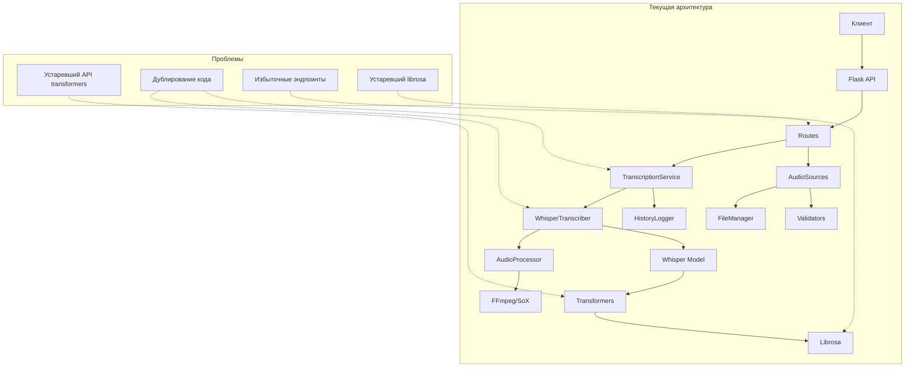
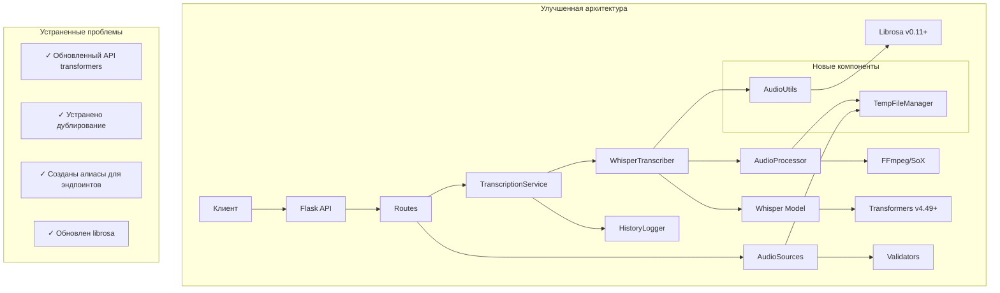
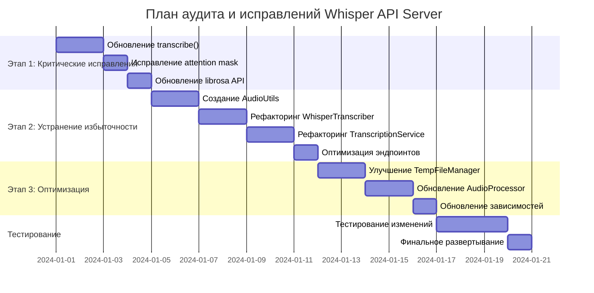
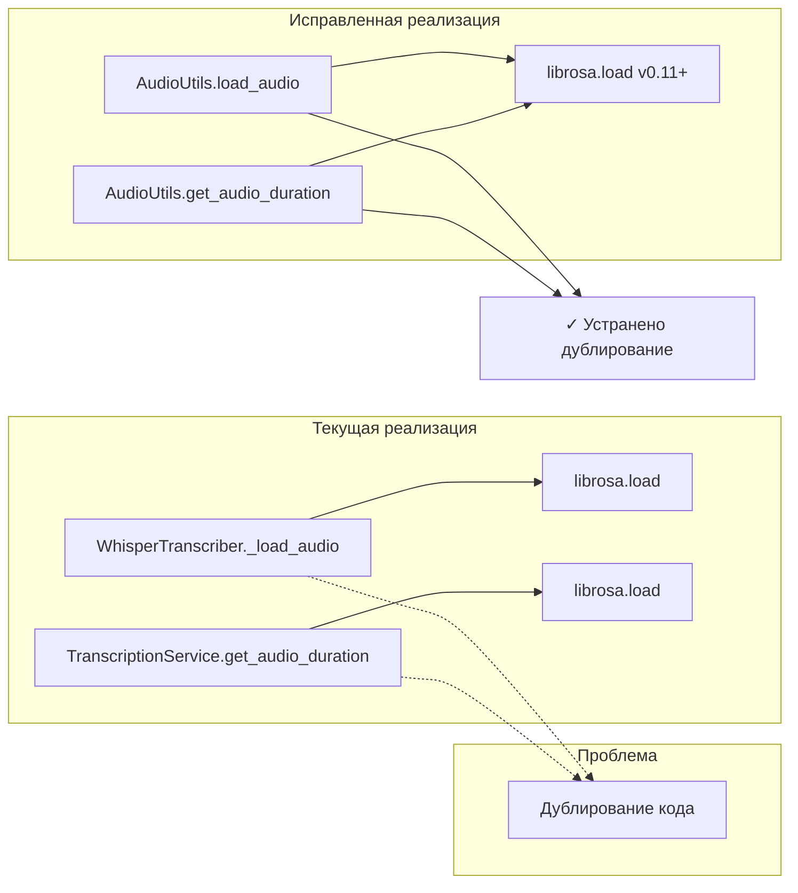
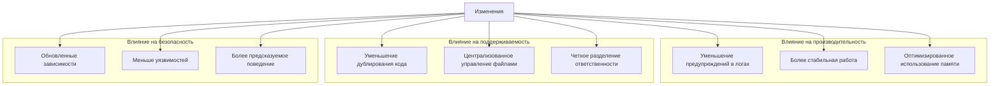
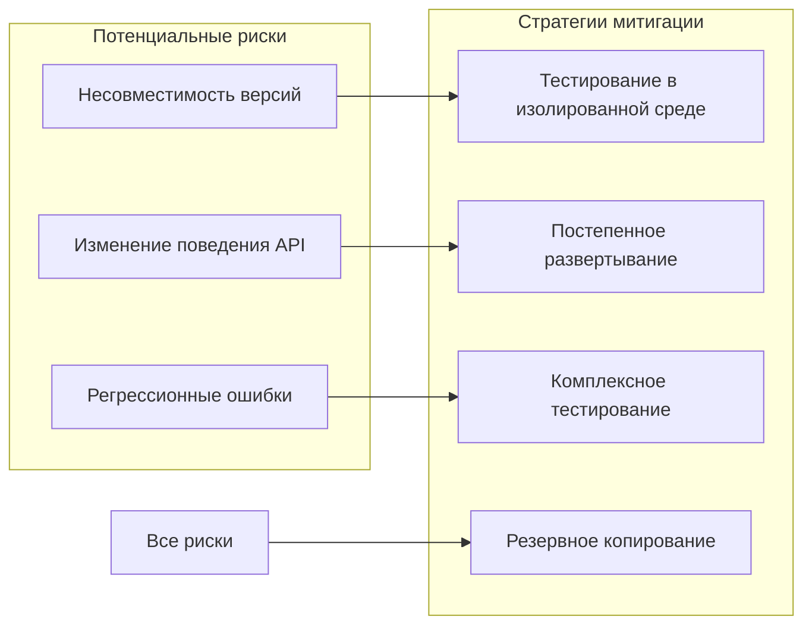

# Whisper API Server - Архитектура аудита и исправлений

## Обзор архитектуры текущего проекта



## Целевая архитектура после исправлений



## План реализации по этапам



## Детализация проблем и решений

### 1. Проблемы с transformers и Whisper

```mermaid
graph LR
    subgraph "Текущая реализация"
        A1[transcribe()] --> A2[inputs]
        A2 --> A3[forced_decoder_ids + language]
        A3 --> A4[Нет attention_mask]
    end
    
    subgraph "Проблемы"
        B1[Устаревший параметр inputs]
        B2[Конфликт параметров]
        B3[Отсутствие mask]
    end
    
    subgraph "Исправленная реализация"
        C1[transcribe()] --> C2[input_features]
        C2 --> C3[attention_mask]
        C3 --> C4[language только]
    end
    
    A1 -.-> B1
    A2 -.-> B2
    A3 -.-> B3
    
    C1 --> Fixed1[✓ Решено]
    C2 --> Fixed2[✓ Решено]
    C3 --> Fixed3[✓ Решено]
```

### 2. Дублирование кода загрузки аудио



### 3. Дублирующиеся эндпоинты API

```mermaid
graph LR
    subgraph "Текущая реализация"
        A1[/v1/audio/transcriptions]
        A2[/v1/audio/transcriptions/multipart]
        A1 --> A3[UploadedFileSource]
        A2 --> A4[UploadedFileSource]
        A3 --> A5[transcribe_from_source]
        A4 --> A6[transcribe_from_source]
    end
    
    subgraph "Проблема"
        B1[Дублирование эндпоинтов]
    end
    
    subgraph "Исправленная реализация"
        C1[_handle_transcription_request]
        C2[/v1/audio/transcriptions]
        C3[/v1/audio/transcriptions/multipart]
        C1 --> C4[UploadedFileSource]
        C4 --> C5[transcribe_from_source]
        C2 --> C1
        C3 --> C1
    end
    
    A1 -.-> B1
    A2 -.-> B1
    
    C1 --> Fixed[✓ Алиасы к общей функции]
```

## Влияние изменений на систему



## Риски и митигация



## Заключение

План аудита и исправлений адресует ключевые проблемы проекта:

1. **Критические проблемы**: Предупреждения в логах, которые могут влиять на функциональность
2. **Проблемы поддерживаемости**: Дублирование кода и избыточные компоненты
3. **Проблемы безопасности**: Устаревшие зависимости

Реализация этого плана улучшит стабильность, поддерживаемость и безопасность проекта без значительного изменения архитектуры.